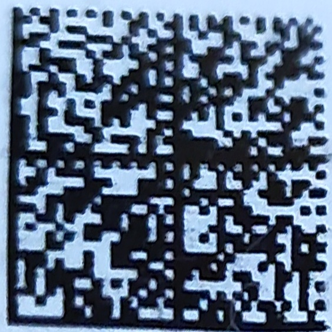

## Демо работы ректификатора

### Доступные алгоритмы

На данный момент реализованы следующие варианты преобразований ректификации:
- Проективное преобразование

### Проективное преобразование

#### Пример 1

**Вход**

```python
src_grid = numpy.int32(
    [
        [1252, 1196],
        [1668, 1496],
        [1712, 1132],
        [1336, 828]
    ]
)
```


**Выход**



