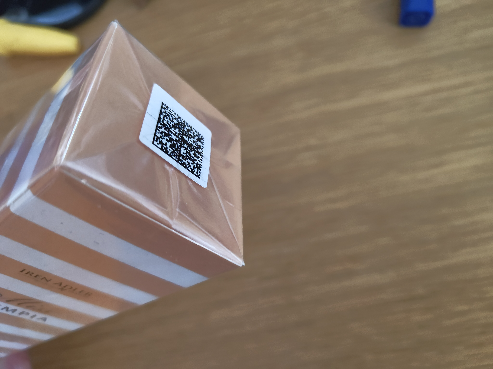
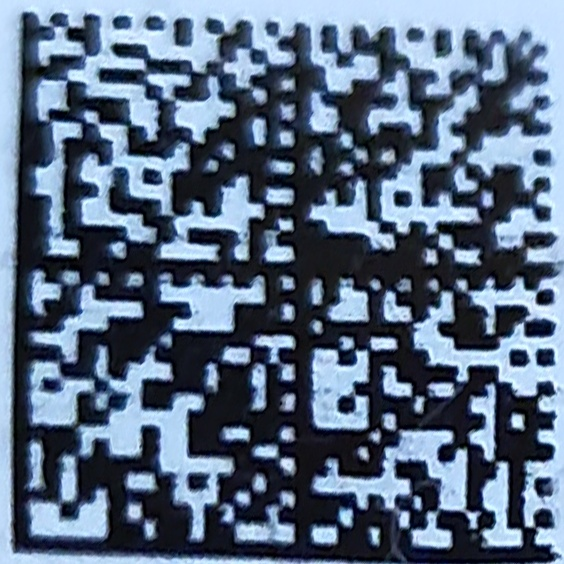
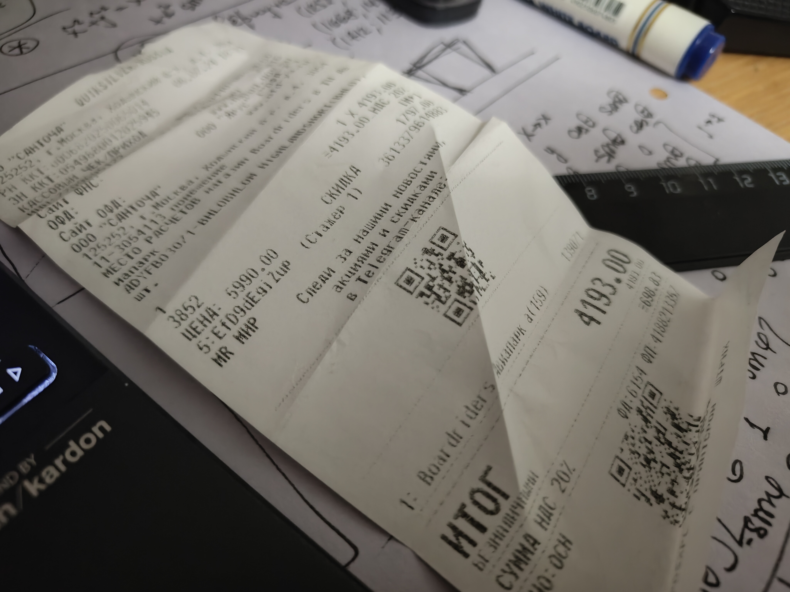
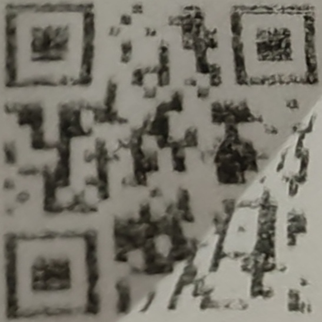
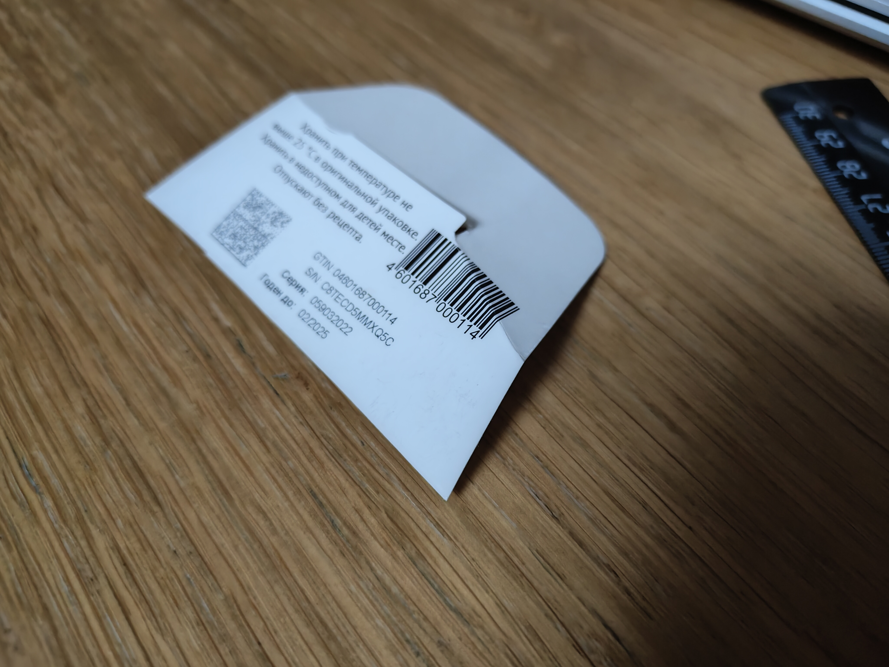
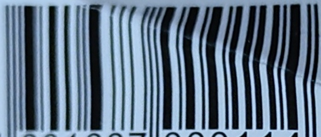

## Демо работы ректификатора

### Доступные алгоритмы

На данный момент реализованы следующие варианты преобразований ректификации:
- Проективное преобразование

### Проективное преобразование

#### Пример 1

**Вход**

```python
src_grid = numpy.int32(
    [
        [1252, 1196],
        [1668, 1496],
        [1712, 1132],
        [1336, 828]
    ]
)
```



**Выход**



### Исправление изогнутого угла

#### Пример 1

**Вход**

```python
src_grid = np.int32(
    [
        [2386, 1704],
        [2476, 1592],
        [2584, 1438],
        [2388, 1224],
        [2284, 1160],
        [2034, 1474]
    ]
)

corner_idx = 2
```



**Выход**



#### Пример 1

**Вход**

```python
src_grid = np.int32(
    [
        [1818, 1219],
        [2237, 1553],
        [2301, 1488],
        [2404, 1426],
        [2094, 1114],
        [1995, 1041]
    ]
)

corner_idx = 3
```



**Выход**


